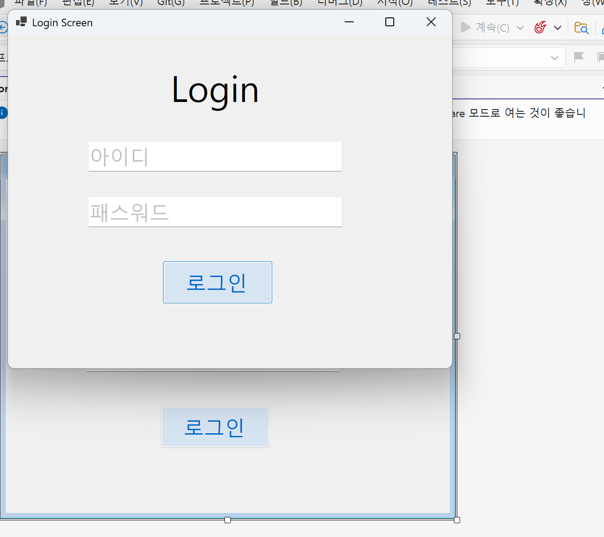

##개요
-c# 프로그래밍 학습
-1줄 소개: 아이디와 패스워드를 받아 처리하는 로그인 화면 프로그래밍
- 사용한 플래폼:c#, visual studio, ,net windows form, github
- 사용한 컨트롤: Label, TextBox, Button, ListBox
- 사용한 기술과 구현한 기능: 이벤트 처리, 데이터 누적, UI 구성, 예외 처리
구현한 기능과 설명
1. 기본 UI 배치 및 속성 설정
사용자 인터페이스(UI) 구성: 사용자가 정보를 입력하고 결과를 확인할 수 있도록 Label(설명), TextBox(입력), Button(실행), ListBox(결과 출력)를 적절한 위치에 배치했습니다.

컨트롤 속성 제어: 각 컨트롤의 Name을 코딩 규칙에 맞게 설정하고, 폰트나 크기 등 기본적인 시각적 요소들을 조정하여 가독성을 높였습니다.

2. Placeholder(입력 힌트) 기능
시각적 안내: 입력창이 비어 있을 때 "아이디", "비밀번호"와 같은 안내 문구를 회색으로 표시하여 사용자가 무엇을 입력해야 하는지 직관적으로 알 수 있게 했습니다.

동적 상태 변경: 사용자가 입력창을 클릭(Enter 이벤트)하면 힌트가 사라지고, 아무것도 입력하지 않고 창을 벗어나면(Leave 이벤트) 다시 힌트가 나타나도록 로직을 구현했습니다.

3. 로그인 인증 및 로직 처리
조건부 접근 제어: 입력된 아이디와 패스워드가 미리 설정된 값과 모두 일치할 때만 로그인이 허용되도록 if 조건문을 활용한 체크 기능을 구현했습니다.

비밀번호 마스킹: 보안을 위해 패스워드 입력 시 실제 글자 대신 점(●)으로 표시되도록 설정했습니다.

## 과제1

                 (img/스크린샷-1.png)
                 (img/스크린샷-1-2.png)
과제 내용
UI 구성: Label(표시), TextBox(입력), Button(전송), ListBox(대화창)를 적절히 배치합니다.
placeholder 표시 : 아이디와 패스워드 입력 힌트를 회색으로 표시
로그인 가능 여부 체크 기능
로그인 성공/ 실패 메시지 박스 보여주기

구현 내용과 기능 설명
메시지 전송 시스템: 입력창에 메시지를 입력하고 전송 버튼을 누르면 메시지가 리스트 박스에 즉시 표시됩니다.
데이터 누적: 전송 버튼을 반복해서 누르면 메시지가 리스트 박스에 한 줄씩 계속 추가되어 대화 내역처럼 관리됩니다.
사용자 편의 기능 (Placeholder): Enter 및 Leave 이벤트를 활용하여 입력창이 비어있을 때 안내 문구(아이디/패스워드 입력 힌트)를 회색으로 표시하여 직관적인 UI를 제공합니다.
예외 처리: 로그인 성공/실패 여부를 판단하여 사용자에게 알림창을 띄워 명확한 피드백을 전달합니다.
아이디입력하고Enter 누르면패스워드입력창으로이동 패스워드입력하고Enter누르면“로그인” 버튼을누른것처럼동작

## 과제 2: 에러 메시지 인라인(Inline) 표시 기능

![과제2 실행화면] (img/스크린샷-2.png)
                  (img/스크린샷-2-2.png)
                  (img/스크린샷-2-3.png)

1. 과제 내용 (Objectives)
에러 표시 방식 변경: 로그인 실패 시 기존의 팝업창(MessageBox) 대신, 입력 폼 화면 내에 에러 메시지를 직접 출력하기
UI 컨트롤 활용: 에러 문구를 표시할 별도의 Label 컨트롤을 추가하고 이를 제어합니다.
상태 제어: Visible 속성을 활용하여 상황에 따라 메시지 보이기와 숨기기 기능 구현
2. 구현 내용 (Implementation Details)
에러 전용 레이블 추가: 아이디/패스워드 입력창 하단에 빨간색 글씨의 Label을 배치합니다. (초기값: Visible = False)
Visible 속성 제어:
로그인 실패 시: lblError.Visible = true; 코드를 통해 "아이디 또는 비밀번호가 틀렸습니다"라는 문구를 화면에 표시합니다.
입력 시작 시: 사용자가 다시 입력을 시작하면 메시지를 다시 숨겨(false) 화면을 깔끔하게 유지합니다.
레이아웃 설계: 에러 메시지가 나타날 때 다른 UI 요소(버튼 등) 위치가 밀리지 않도록 고정된 위치에 배치하거나 적절한 여백을 설정합니다.
3. 기능 설명
에러 상황(아이디/비번 불일치)에서만 메시지가 나타나도록 컨트롤의 상태를 관리합니다.

## 과제 3: 사용자 편의성(UX) 강화 및 포커스 제어

![과제3 실행화면] 
1. 과제 목표 
입력 흐름 최적화: 사용자가 아이디와 패스워드를 마우스 조작 없이도 빠르고 효율적으로 입력할 수 있는 환경을 구축합니다.
사용자 친화적 기능 추가: 오입력 시 편리하게 내용을 수정하거나 확인할 수 있는 부가 기능을 구현합니다.
2. 구현 내용 
Enter 키 포커스 흐름 제어:
아이디 입력창: 아이디 입력 후 Enter 키를 누르면 패스워드 입력창으로 포커스(Focus)가 즉시 이동하도록 구현합니다.
패스워드 입력창: 패스워드 입력 후 Enter 키를 누르면 로그인 버튼을 클릭한 것과 동일하게 로그인 로직이 시작됩니다.
편리한 UI/UX 기능 구현:
전체 지우기 기능: 버튼 하나로 아이디와 패스워드 입력창을 동시에 비워주는(Clear) 기능을 제공합니다.
패스워드 보기/숨기기: 마스킹 처리된 패스워드를 사용자가 원할 때 확인할 수 있도록 토글(Toggle) 기능을 추가합니다. (예: 눈 모양 아이콘 또는 체크박스 활용)
3. 기능 설명  
키보드 중심의 입력 경험: 마우스로 일일이 칸을 옮길 필요가 없어 입력 속도가 비약적으로 향상되며, 로그인의 연속성이 유지됩니다.
입력 오류 최소화: 패스워드 보기 기능을 통해 사용자가 본인이 입력한 값을 확신할 수 있게 하여, 잘못된 입력으로 인한 반복적인 로그인 시도를 방지합니다.
